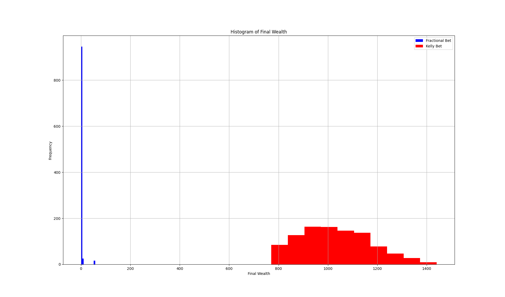
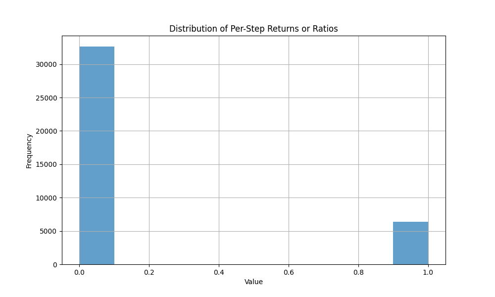
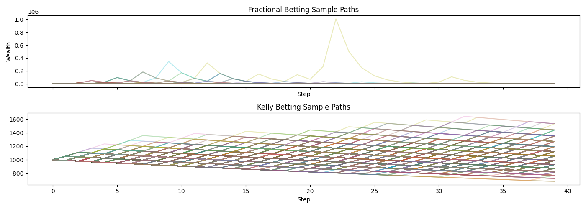

# Application of Random Processes in real life

  

# Kelly Betting Strategy

This repository contains the simulation script used for **Kelly Criterion** betting strategy. The Kelly Criterion is a mathematical formula used to determine the optimal size of a series of bets to maximize wealth growth while minimizing risk.

## Overview

The purpose of this project is to demonstrate how the Kelly Criterion can be applied to various betting scenarios, including **mutually exclusive events**, to determine optimal bet sizing.

In this repository, you'll find a detailed Python implementation of the Kelly Criterion, along with simulations and results visualized in various plots.

### Distribution of final wealth

### Distribution of outcomes

### Sample path comparison

